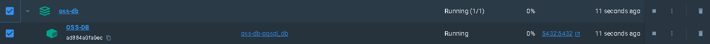
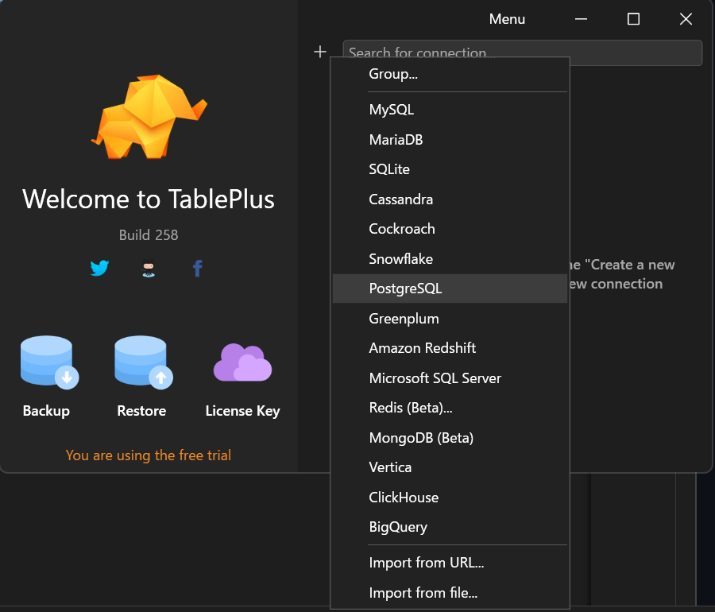
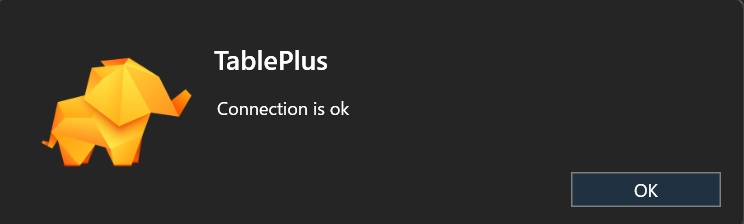
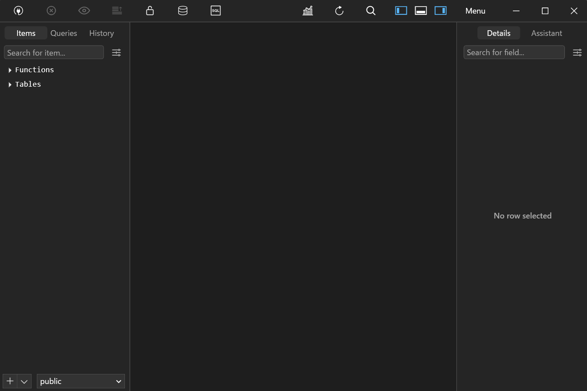

# OSS-DB
OSS-DB資格学習用リポジトリ

## Dockerでの環境構築

### 1. Dockerをインストール
[Docker Desktop 公式ページ](https://www.docker.com/products/docker-desktop/)からインストール

### 2.「docker-compose.yml」を作成
ローカル環境で動かしたい場合は、「docker-compose.yml」の作成でローカル環境構築が可能
```
version: '3'

services:
  db:
    image: postgres:14
    container_name: postgres_pta
    ports:
      - 5432:5432
    volumes:
      - db-store:/var/lib/postgresql/data
    environment:
      POSTGRES_USER: 'user'
      POSTGRES_PASSWORD: 'postgres'
volumes:
  db-store:
```
- 「docker-compose.yml」はプロジェクトのディレクトリ直下に作成

■ 設定変更について
- version: docker-composeで使用するバージョンを定義
- services: サービス (コンテナ) を定義
- image: Dockerイメージは、クラウド上のレジストリ「Docker Hub」からダウンロードして使うことができる他、自分で作って使うことも可能
```
・今回は、「postgres:14」を「Docker Hub」からダウンロードして使用する。
・今回使用していないが、「postgres:14-alpine」を使用する場合、alpineは、postgres:14 と比較して、イメージサイズが小さく、ダウンロードやコンテナ起動がスマートになる。
```  

- container_name: コンテナの名前を指定
- volumes: DBファイルのパス(/var/lib/postgresql/data)をvolumeにマウントして永続化
- environment: 環境変数の設定
  - POSTGRES_PASSWORD： パスワード。※必須項目
  - POSTGRES_USER： ユーザ名。※指定しなかった場合、デフォルトpostgres
  - POSTGRES_DB： DB名。※指定しなかった場合、デフォルトpostgres

■ 設定変更について
ローカル環境であれば「Dockerfile」は作成する必要はないが、「Dockerfile」を使用する場合は、「docker-compose.yml」は以下のように設定する必要がある
```
version: '3.9'

services:
  pgsql_db:
    # build: .でdocker-compose.ymlと同じフォルダにDockerfileがあることを示す
    build: .
    container_name: ${CONTAINER_NAME}
    hostname: ${HOSTNAME}
    ports:
      - 5432:5432
    volumes:
      - db-store:/var/lib/postgresql/data
    environment:
      POSTGRES_USER: ${USER_NAME}
      POSTGRES_PASSWORD: ${USER_PASS}
volumes:
  db-store:
```

### 3.「Dockerfile」を作成
Dockerfileとは、新規にDockerイメージを作成するための手順を記したテキストファイル。<br />
Dockerfileを使用する理由は以下などがある

- Dockerfileというテキストファイルを作成することで、Docker Imageを作ることが出来る
- 一連の手順を自動化できる
- ファイルで管理できる
- 自分の好きなようにカスタマイズすることができる

■ Dockerfileの作成方法
```
FROM postgres:15.2

# Time ZoneAc
ENV TZ Asia/Tokyo
```

### 4.「.env」を作成
.envファイルでパラメータ(DB接続情報)を変数として定義する
```
POSTGRES_VERSION=15.2
CONTAINER_NAME=OSS-DB 
HOSTNAME=OSS-DB 
USER_NAME=user
USER_PASS=postgres
```

### 5. 接続方法
以下のコマンドで、コンテナを作成・起動する
```
docker-compose up -d
```

特にエラーが出ていなければ問題なし。<br />
コマンドでコンテナが立ち上がっているかは以下コマンドで確認可能
```
docker ps -l
```

確認結果
```
CONTAINER ID   IMAGE             COMMAND                   CREATED              STATUS              PORTS                    NAMES
ad884a0fa0ec   oss-db-pgsql_db   "docker-entrypoint.s…"   About a minute ago   Up About a minute   0.0.0.0:5432->5432/tcp   OSS-DB
```

### 6. Dockerでコンテナが立ち上がっていることを確認


### 7. DB接続手順
DB接続確認のため、TablePlusを使用<br />
※[TablePlus公式ページ](https://tableplus.com/)で「TablePlus」をインストール

1. 「PostgreSQL」を選択


2. DB接続設定は以下のように設定し、「test」を押下し、接続確認
- 「docker-compose.yml」に記載した、ユーザ名、パスワードを設定
- Host/Socketはローカル環境用のため、「127.0.0.1」を設定
- Databaseは「postgres」
- PortはPostgresを使用するため、「5432」を指定


- 以下の画面が表示されると、接続が成功し、「OK」を押下する



3. 接続情報を保存する必要があるので、「save」を押下する

4. 「connect」または対象のDB接続情報をダブルクリックし、ローカルDBが接続されたことを確認

